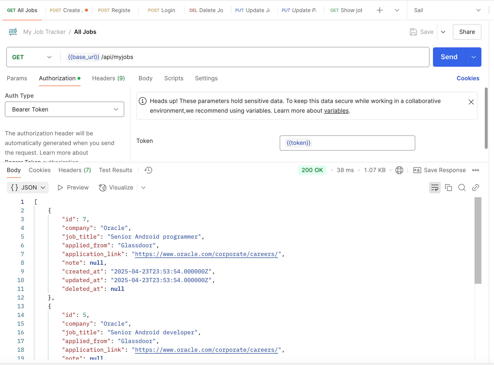

# Job-RESTAPI

Restful api for job tracker.

### Backend

-   **User Authentication**: User registration, login, and logout using Laravel Sanctum.
-   **Job Management**: CRUD operations for job applications.
    -   **Create Job**: Add a new job application.
    -   **Read Job**: View job applications.
    -   **Update Job**: Update job applications.
    -   **Delete Job**: Soft delete job applications.
-   **Database**: SQLite database for testing, MySQL for production.
-   **API Endpoints**:
    -   `POST /api/register`: Register a new user.
    -   `POST /api/login`: Log in a user.
    -   `POST /api/logout`: Log out a user.
    -   `GET /api/myjobs`: List all job applications.
    -   `POST /api/myjobs`: Create a new job application.
    -   `GET /api/myjobs/{id}`: View a specific job application.
    -   `PUT /api/myjobs/{id}`: Update a specific job application.
    -   `DELETE /api/myjobs/{id}`: Delete a specific job application.
-   **Testing**: PHPUnit tests for backend functionality.
-   **Docker**: Docker support for easy setup and deployment.

## Register

## Login

## Get all jobs

## Create job

## Update job

    

## Show job

## Delete job

## API authorization

